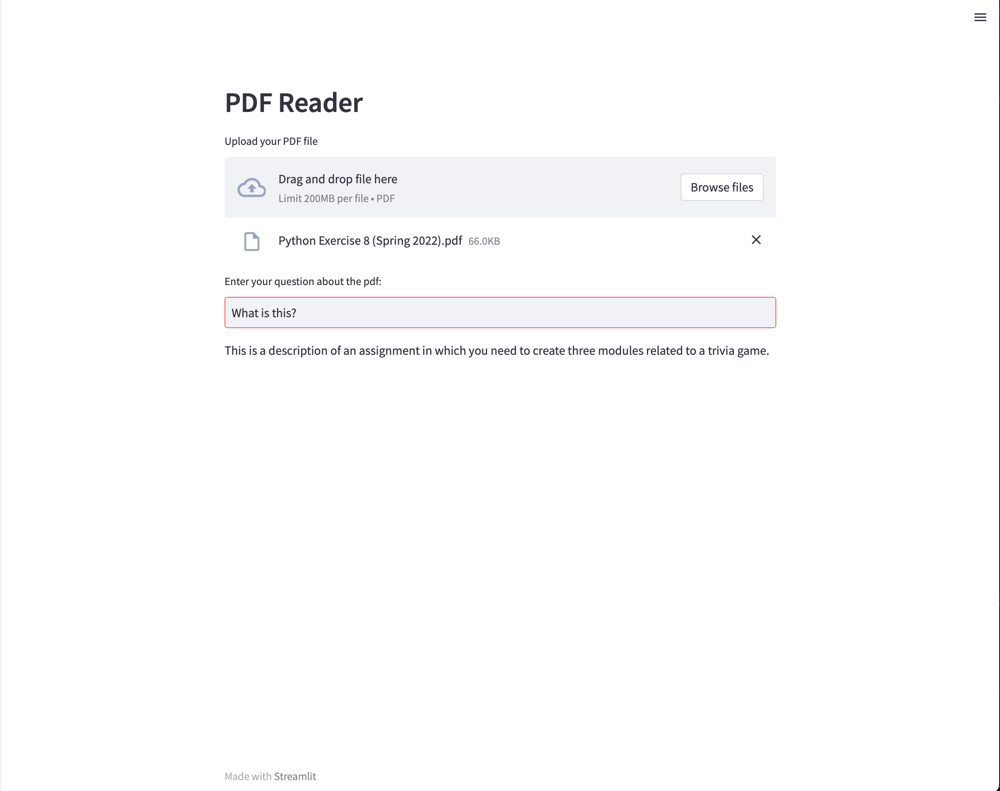

# PDF_Reader
A PDF_Reader web app built with Streamlit, Python, and Langchain. Feel free it use this as your own.

## How it works?
When you upload a document, it gets split into smaller sections and stored in a special kind of database called a vector index. This type of database allows for semantic search and retrieval, which means it can find related information even if the individual words aren't exact matches. 

When you ask a question, the model searches through these document sections using the vector index to find relevant information and ultimately provide an answer.



## Usage 
1. ```git clone https://github.com/hieuminh65/PDF_Reader.git```
2. ```pip3 install -r requirements.txt```
3. Paste your API keys in the .env.example file and rename the file to .env
4. Run ```streamlit run streamlit__app.py```